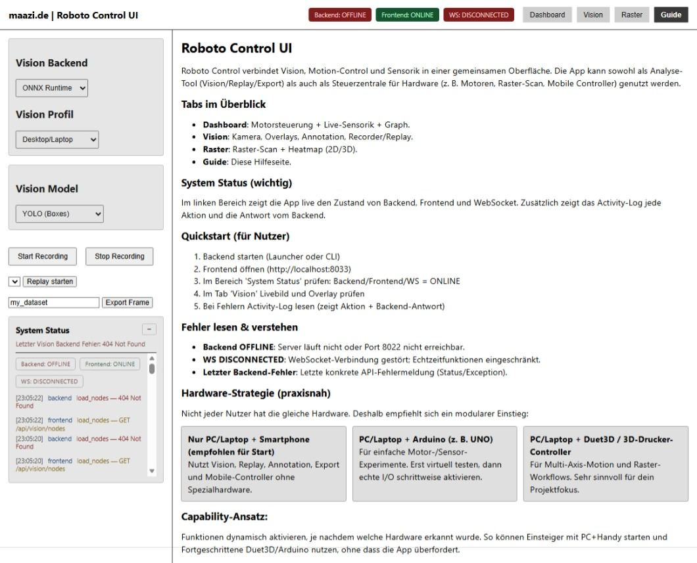

[EN](./README.md) ｜ DE

# roboto - Modulares Robotics & Vision Framework

**roboto** ist ein modulares Robotics-Framework mit Multi-Achsen-Motion-Control, Multi-Node-Vision-System, Sensor-Integration, KI-gestützten Tools, Dataset-Export, Replay-System und einer modernen Web-UI.

[**_Preview: roboto.maazi.de_**](https://roboto.maazi.de)
<be>



## Live-Vorschau

Eine Live-Vorschau der Anwendung ist auf dem VPS des Autors verfügbar unter [**roboto.maazi.de**](https://roboto.maazi.de). **Beachte jedoch bitte, dass ohne angeschlossene Hardware (Arduino, Sensoren usw.) bestimmte Funktionen wie Bewegungskontrolle und Sensormessungen nicht funktionieren oder Platzhalterdaten anzeigen werden.** Das Vision-System und die UI funktionieren normal, aber volle Funktionalität erfordert die entsprechende Hardware-Anbindung.

Wenn du kompatible Hardware hast, kannst du sie anschließen und das System sollte sie automatisch erkennen und nutzen.

---

## Inhaltsverzeichnis

- [Funktionen](#funktionen)
- [Projektstruktur](#projektstruktur)
- [Installation & Setup](#installation--setup)
- [Anwendung ausführen](#anwendung-ausführen)
- [Live-Vorschau](#live-vorschau)
- [Entwicklung vs Release](#entwicklung-vs-release)
- [Zukünftige Arbeit](#zukünftige-arbeit)
- [Lizenz](#lizenz)

## Übersicht

roboto ist als erweiterbare Plattform für Robotik-Experimente und -Entwicklung konzipiert. Es integriert Hardware-Steuerung (Arduino, Duet3D), Computer-Vision (YOLO, Segmentierung, Pose-Schätzung), Sensor-Fusion (IMU, Lidar, optisch, Strom) und eine responsive Web-UI, die mit Svelte erstellt wurde.

Der Framework betont Modularität, sodass Benutzer Komponenten basierend auf ihrer Hardware-Ausstattung und Experimentierziele kombinieren und austauschen können.

## Funktionen

### Robotik / Bewegungskontrolle

- Multi-Achsen-Bewegungskontrolle
- Bewegungsplaner
- Raster-Scan & Wärmebild-Scan
- Kollisionsschutz- Autofokus
- Vision Follow & Spot Follow
- Duet3D-Integration
- Arduino-Firmware-Unterstützung

### Vision-System

- Multi-Node-Vision (PC, Jetson, Mobile Geräte)
- YOLO / Segmenter / Pose-Schätzung (modellunabhängige Pipeline)
- Vision-Recorder & Replay
- Annotation-Werkzeuge (Umrahmende Boxen, Masken, Schlüsselpunkte)
- Dataset-Export (YOLO, COCO, Pose, Segmentierung)
- Modell-Wechsler
- Leistungsüberlagerung (FPS, Latenz)
- Gesundheitsüberwachung (gesund/degradiert/offline)
- Auto-Reconnect für entfernte Nodes

### Sensor-Integration

- IMU (Trägheitsmessunit)
- Lidar
- Optische Sensoren
- Stromsensoren
- Mobile Gerätesensoren

### Web-UI (Svelte)

- Vision-Dashboard (Live-Stream, Überlagerungen)
- Bewegungssteuerungs-Panel
- Sensor-Live-Graphen
- 3D-Wärmebild-Ansicht
- Replay-Spieler
- Annotation-Werkzeuge
- Dataset-Export-Panel
- Modell-Wechsler- Backend-Wechsler
- Node-Wechsler
- Systemstatus-Übersicht

### Server- REST-API (`server/api_vision.py`)

- Vision-Streaming-Server (`server/video_stream.py`)
- WebSocket-Server (`server/websocket_server.py`)
- Mobile WebSocket (`server/mobile_ws.py`)

### Mobile Client

- Vision & Sensor-Streaming-Client
- Auto-Reconnect-Fähigkeit
- Einfache HTML/JS-Schnittstelle

## Projektstruktur

```
roboto/
 ├── ARCHIVE/              # Historische Entwicklungsdokumente
 ├── build/                # Frontend-Build-Ausgabe
 ├── cli/                  # Befehlszeilenschnittstelle (Typer-basiert)
 ├── config/               # Konfigurationsdateien (Vision)
 ├── core/                 # Kernfunktionalität
 │   ├── combined/         # Kombinierte Module (Bewegung+Vision+KI)
 │   ├── config/           # Kernkonfiguration
 │   ├── control/          # Bewegungssteuerung
 │   ├── hardware/         # Hardware-Schnittstellen (Arduino, Duet3D)
 │   ├── motors/           # Motorcontroller
 │   ├── sensors/          # Sensortreiber
 │   └── vision/           # Vision-Verarbeitungspipeline
 ├── launcher/             # Tkinter-basierter Desktop-Launcher
 ├── mobile/               # Mobile Client-Dateien
 ├── recordings/           # Sitzungsaufzeichnungen
 ├── roboto-release/       # Release-Bundle (Ausführung/Deployment)
 ├── server/               # Serverkomponenten (API, Streaming, WebSockets)
 ├── src/                  # Svelte-Frontend-Quellcode
 │   ├── App.svelte
 │   ├── main.js
 │   ├── components/       # UI-Komponenten
 │   ├── pages/            # Seitenkomponenten
 │   └── store/            # Zustandsverwaltung
 ├── templates/            # Bewegungsvorlagen
 ├── .vscode/              # VS Code-Einstellungen
 ├── index.html            # Frontend-Einstiegspunkt
 ├── jsconfig.json
 ├── package.json
 ├── package-lock.json
 ├── setup.py ├── svelte.config.js
 └── vite.config.js
```

## Installation & Setup

### Voraussetzungen

- **Python 3.11+**
- **Node.js 20 LTS**
- **npm** (kommt mit Node.js)
- Optional aber empfohlen für volle Funktionalität: Arduino oder ähnliche Hardware

### Backend-Setup

1. Repository klonen:

```bash
git clone <repository-url>
cd roboto
```

2. Python-virtuelle Umgebung erstellen und aktivieren:

```bash
python -m venv .venv
# Windows
.\.venv\Scripts\Activate.ps1
# Linux/macOS
source .venv/bin/activate
```

3. Backend-Abhängigkeiten installieren:

```bash
pip install --upgrade pip
pip install fastapi "uvicorn[standard]" opencv-python requests typer pyserial numpy
```

4. (Optional) CLI-Tool installieren:

```bash
pip install -e .
```

### Frontend-Setup

1. Node.js-Abhängigkeiten installieren:

```bash
npm install
```

2. Das Frontend ist bereit für Entwicklung oder Build.

### Mobile Client

Keine Installation erforderlich – öffne einfach `mobile/index.html` im Browser und konfiguriere die WebSocket-Verbindung zu deinem Backend.

## Anwendung ausführen

### Nur Backend

Um den Backend-Server zu starten:

```bash
# Mit virtueller Umgebung (falls aktiviert)
python -m uvicorn server.video_stream:app --host 0.0.0.0 --port 8022 --reload
```

Oder über die CLI:

```bash
roboto start-backend
```

Der Backend ist unter `http://localhost:8022` verfügbar.

### Nur Frontend (Entwicklungsmodus)

Um den Frontend-Entwicklungsserver zu starten:

```bash
npm run dev -- --host 0.0.0.0 --port 8033
```

Dann öffne `http://localhost:8033` in deinem Browser.

### Voller Stack (Entwicklung)

1. Backend in einem Terminal starten:

```bash
.\.venv\Scripts\Activate.ps1  # Windows
# oder
source .venv/bin/activate     # Linux/macOS
python -m uvicorn server.video_stream:app --reload --port 8022
```

2. Frontend in einem anderen Terminal starten:

```bash
npm run dev -- --port 8033
```

3. UI unter `http://localhost:8033` und Backend-API unter `http://localhost:8022` aufrufen.

### Produktions-Build

Um einen Produktions-Build des Frontends zu erstellen:

```bash
npm run build
```

Dies erzeugt optimierte statische Dateien im `build/` Verzeichnis.

Um den Produktions-Build bereitzustellen:

```bash
# Einfacher statischer Server (zum Testen)
npx serve build
# Oder nach roboto-release/ui/build/ für Docker/Deployment kopieren
xcopy /E /I /Y build\* roboto-release\ui\build\  # Windows
# odercp -r build/* roboto-release/ui/build/         # Linux/macOS
```

### Docker-Deployment

Das `roboto-release/` Verzeichnis enthält Docker-Dateien für eine einfache Bereitstellung:

```bash
cd roboto-release
docker compose up --build
```

Dies startet:

- Backend auf Port `8022`
- UI auf Port `8033`

Hinweis: Der UI-Container erwartet den Frontend-Build im Verzeichnis `roboto-release/ui/build/`. Führe `npm run build` aus und kopiere die Ausgabe, bevor du Docker-Images erstellst, wenn du Frontend-Änderungen vorgenommen hast.

## Live-Vorschau

Eine Live-Vorschau der Anwendung ist auf dem VPS des Autors verfügbar unter [**roboto.maazi.de**](https://roboto.maazi.de). **Beachte jedoch bitte, dass ohne angeschlossene Hardware (Arduino, Sensoren usw.) bestimmte Funktionen wie Bewegungskontrolle und Sensormessungen nicht funktionieren oder Platzhalterdaten anzeigen werden.** Das Vision-System und die UI funktionieren normal, aber volle Funktionalität erfordert die entsprechende Hardware-Anbindung.

Wenn du kompatible Hardware hast, kannst du sie anschließen und das System sollte sie automatisch erkennen und nutzen.

## Entwicklung vs Release

- **`roboto/`** – Entwicklungsverzeichnis mit vollem Quellcode (`src/`, `templates/`, etc.)
- **`roboto-release/`** – Release-Bundle mit nur dem Nötigen zum Ausführen der Anwendung:
  - Vorgebautes Frontend (`ui/build/`)
  - Backend-Code
  - Mobile Client
  - CLI und Launcher-Tools - Docker-Konfiguration
  - Startskripte

Diese Trennung stellt sicher, dass das Release sauber und auf Ausführung fokussiert ist, während das Entwicklungsverzeichnis alle Werkzeuge für Erweiterung und Modifikation behält.

## Zukünftige Arbeit

Der Autor plant die Weiterentwicklung mit potenziellen zukünftigen Verbesserungen einschließlich:

- QR-Code-Generator für einfache Mobile-Client-Einrichtung
- Live-Backend-Streaming-Protokolle im Launcher
- Node-Gesundheitsüberwachungs-Dashboard
- Mobile-Client-Statusanzeigen
- Zusätzliche Launcher-Buttons für Recorder/Replay, Modellwechsel, Dataset-Export
- Verbessertes Launcher-Design (Symbole, Farben)

Beiträge, Feedback und Ideen sind willkommen!

## Lizenz

Dieses Projekt steht unter der MIT-Lizenz – siehe die LICENSE-Datei für Details.

## Danksagung

Dank der Open-Source-Community für die verschiedenen Bibliotheken und Tools, die dieses Projekt möglich machen.
